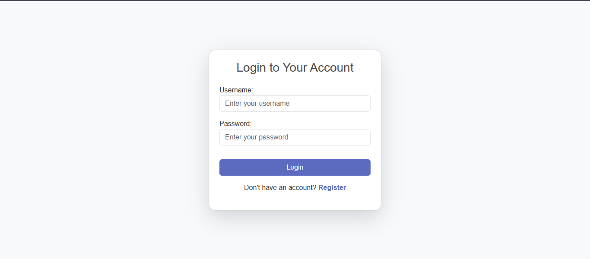

# Django To-Do App  

## 📋 Overview  
This repository contains the source code for a simple To-Do application built with Django. The project demonstrates the use of Django's models, views, templates, and forms to perform CRUD (Create, Read, Update, Delete) operations. It's an ideal beginner-friendly project to learn and practice Django fundamentals.  

---

## 🚀 Features  
- Add new tasks  
- View all tasks in a list  
- Mark tasks as complete or incomplete  
- Edit existing tasks  
- Delete tasks  
- User-friendly interface with Bootstrap  

---

## 🛠️ Tech Stack  
- **Backend:** Django (Python)  
- **Database:** SQLite (default Django database)  
- **Frontend:** HTML, CSS, and Bootstrap  

---

## 📂 Project Structure  

```plaintext
django-todo-app/
│
├── todo/
│   ├── migrations/         # Database migrations
│   ├── templates/          # HTML templates for the app
│   │   ├── base.html       # Base template for all pages
│   │   ├── index.html      # Home page template
│   │   └── form.html       # Template for adding/editing tasks
│   ├── static/             # Static files (CSS, images, etc.)
│   ├── models.py           # Task model definition
│   ├── views.py            # Logic for handling requests and responses
│   ├── urls.py             # URL routing for the app
│   └── admin.py            # Django admin customization
│
├── manage.py               # Django project management script
├── db.sqlite3              # SQLite database file
├── requirements.txt        # Python dependencies
└── README.md               # Project documentation
```  

---

## ⚙️ Setup and Installation  

### Prerequisites  
- Python 3.x installed  
- pip (Python package manager)  

### Steps  
1. Clone the repository:  
   ```bash
   git clone https://github.com/your-username/django-todo-app.git
   cd django-todo-app
   ```  

2. Create a virtual environment:  
   ```bash
   python -m venv env
   source env/bin/activate  # On Windows: env\Scripts\activate
   ```  

3. Install dependencies:  
   ```bash
   pip install -r requirements.txt
   ```  

4. Apply migrations:  
   ```bash
   python manage.py migrate
   ```  

5. Run the server:  
   ```bash
   python manage.py runserver
   ```  

6. Open your browser and navigate to:  
   ```
   http://127.0.0.1:8000
   ```  

---

## 🖼️ Screenshots  
### Home Page  
  

### Register
  

### Login
  

---

## 🤝 Contributing  
Contributions are welcome! Here's how you can contribute:  
1. Fork the repository  
2. Create a feature branch:  
   ```bash
   git checkout -b feature-name
   ```  
3. Commit your changes:  
   ```bash
   git commit -m "Add your message here"
   ```  
4. Push to the branch:  
   ```bash
   git push origin feature-name
   ```  
5. Submit a pull request  

---

## 📜 License  
This project is licensed under the MIT License. See the `LICENSE` file for details.  

---

## ⭐ Acknowledgements  
- Django documentation: [https://docs.djangoproject.com/](https://docs.djangoproject.com/)  
- Bootstrap framework: [https://getbootstrap.com/](https://getbootstrap.com/)  

---

### 🌟 If you found this helpful, please give this repository a star!
```  

Let me know if there’s anything you’d like to add or modify!
